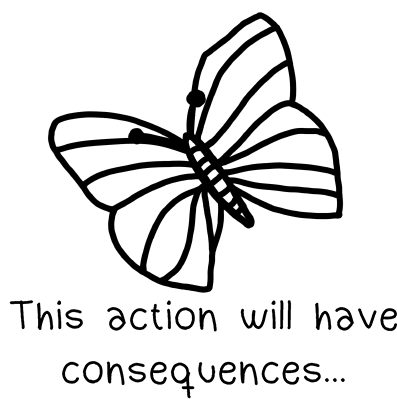

    <picture>
        <source
            media="(prefers-color-scheme: dark)"
            srcset="assets/butterfly-effect-lis-white.gif"
        />
        <source
            media="(prefers-color-scheme: light)"
            srcset="assets/butterfly-effect-lis-black.gif"
        />
        
    </picture>

Hi, my name is **Patrik Bajzík**, and I am:
- a student
- an abstraction poet
- a coffee connoisseur

> "*Insanity:* Doing the same thing over and over again and expecting
different results."

# Experience 💼

### A Product Developer in *Slovenská sporiteľňa, a.s.*
- Maintained and refactored an internal AI-powered web app (Streamlit, Python)
- Improved structure from single-file monolith to modular codebase
- Implemented feature updates based on cross-team requirements
- Rebuilt a monolithic application into a full-stack architecture (React + TypeScript,
Flask/FastAPI)
- Worked with data pipelines (Keboola, SQL, Snowflake) and created dashboards
in Power BI

### Frontend Development (React / Next.js)
- Designed and implemented reusable UI components in React (TypeScript, Next.js)
- Focused on abstraction and reusability across internal systems

### Personal Projects & Learning
- Built and deployed a full-stack application (MERN) with real database integration
- Experimented with deployment (Vercel, Render, MongoDB Atlas)
- Explored backend development in TypeScript, Go, and Java (Spring Boot)

### Currently
- Working on a bachelor thesis project – building an information system
- Exploring microservices architecture (Spring Boot, Next.js, Auth0)
- Following MVP approach and focusing on building systems from scratch

# Architectural Preference ⚙️

# My Statistics 📊

# Contact Me 📫

